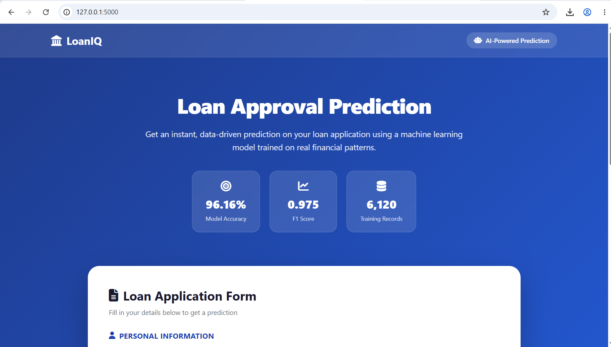
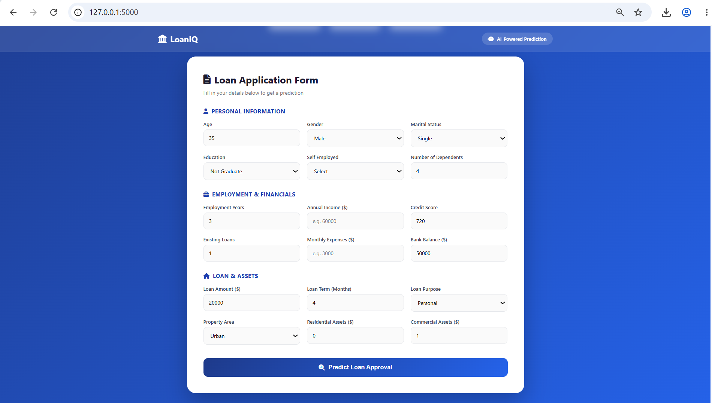
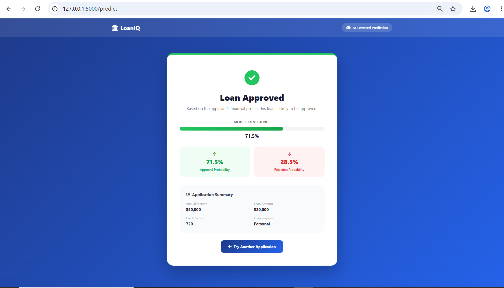

# 🏦 Loan Approval Prediction — Flask Web App


A full-stack machine learning web application that predicts loan approval decisions in real time. Users fill out a loan application form in the browser, and a tuned Random Forest model — trained on a real-world messy dataset — returns an instant prediction with a confidence score.

---

## 📌 Project Overview

This project takes a complete ML pipeline (data cleaning → EDA → feature engineering → model training → tuning) and deploys it as an interactive web application using Flask. It's designed to demonstrate the full journey from raw data to a usable, production-style product — not just a notebook.

| | |
|---|---|
| **Task** | Binary classification — Approved vs Rejected, served via a live web form |
| **Dataset size** | 6,120 loan applications, 23 raw columns |
| **Final model** | Random Forest (tuned via GridSearchCV) |
| **Final performance** | **96.16% accuracy · 0.975 F1** |
| **Stack** | Python, Flask, Scikit-learn, HTML/CSS/JS |

---

## ✨ Features

- **Interactive prediction form** — 18 input fields covering personal, employment, and financial details
- **Real-time ML prediction** — trained Random Forest model runs inference on submission
- **Confidence scoring** — shows the model's probability for both Approved and Rejected outcomes, not just a hard yes/no
- **Responsive design** — fully usable on mobile and desktop
- **Client-side + server-side validation** — form checks required fields before submission, and Flask handles bad input gracefully with error messages instead of crashing
- **Application summary** — result page recaps key applicant details alongside the prediction

---


## 🧹 The Machine Learning Pipeline

### Data Cleaning
The raw dataset was intentionally messy: inconsistent text casing (`M`/`Male`/`male`/`MALE`), a whitespace-corrupted numeric column (`credit_score` stored as `' 764.0'`), a fully empty column, a duplicate index column, and junk free-text — all standardized and cleaned.

### EDA Findings
Demographic features (gender, marital status, education, property area) showed almost no effect on approval — rates stayed within 1–3 points of the 76.8% baseline. Credit score, however, showed a strong effect:

| Credit Band | Approval Rate |
|---|---|
| Poor | 64.8% |
| Fair | 73.7% |
| Good | 90.8% |
| Excellent | 91.7% |

### Feature Engineering
Five engineered features were added: `debt_to_income`, `total_assets`, `asset_to_loan_ratio`, `expense_ratio`, and `credit_score_band`. Three of these ranked in the model's top 6 most important features — outperforming several raw columns.

### Model Comparison

| Model | Accuracy | Precision | Recall | F1 |
|---|---|---|---|---|
| Logistic Regression | 83.4% | 0.932 | 0.846 | 0.887 |
| Decision Tree | 95.0% | 0.972 | 0.963 | 0.967 |
| **Random Forest (tuned)** | **96.2%** | **0.975** | **0.976** | **0.975** |

Hyperparameter tuning via `GridSearchCV` (5-fold CV) improved F1 from 0.968 → 0.975.

**Top features by importance:** `debt_to_income` (engineered), `income_annual`, `monthly_income` (engineered), `credit_score`, `existing_loans`, `expense_ratio` (engineered).

Full analysis and code available in [`notebooks/main.ipynb`](notebooks/main.ipynb).

---

## 🏗️ Project Structure
loan-approval-prediction-webapp/
│
├── app.py                     # Flask application entry point
├── requirements.txt           # Python dependencies
├── README.md
├── .gitignore
│
├── model/
│   ├── model.pkl               # Trained Random Forest model
│   └── model_columns.pkl       # Encoded feature column structure
│
├── notebooks/
│   ├── main.ipynb              # Full ML pipeline: cleaning → EDA → modeling
│   └── loan_dataset_messy.csv
│
├── src/
│   ├── __init__.py
│   ├── preprocessing.py       # Transforms raw form input into model-ready format
│   └── prediction.py          # Loads model, runs inference, returns confidence scores
│
├── templates/
│   ├── index.html              # Landing page + application form
│   └── result.html             # Prediction result page
│
└── static/
    ├── css/
    │   └── style.css
    ├── js/
    │   └── script.js
    └── images/
        ├── screenshot-landing.png
        ├── screenshot-form.png
        └── screenshot-result.png

---
## 🖼️ Screenshots

## 🖼️ Screenshots

### Landing Page


### Application Form


### Prediction Result

## ⚙️ How It Works (Data Flow)
User fills form (index.html)
↓
POST request to /predict
↓
app.py receives form data
↓
src/preprocessing.py
→ feature engineering
→ encoding
→ column alignment with training data
↓
src/prediction.py
→ loads model.pkl
→ runs predict() and predict_proba()
↓
Result + confidence score
↓
Rendered on result.html

---

## 🚀 Installation & Running Locally

**1. Clone the repository**
```bash
git clone https://github.com/talalnoor/Loan-Approval-Prediction-WebApp.git
cd Loan-Approval-Prediction-WebApp
```

**2. Create and activate a virtual environment**
```bash
python -m venv venv

# Windows
venv\Scripts\activate

# Mac/Linux
source venv/bin/activate
```

**3. Install dependencies**
```bash
pip install -r requirements.txt
```

**4. Run the app**
```bash
python app.py
```

**5. Open in browser**
http://127.0.0.1:5000

---

## 🧰 Technologies Used

**Backend:** Python, Flask
**Machine Learning:** Scikit-learn, Pandas, NumPy, Joblib
**Frontend:** HTML5, CSS3, JavaScript, Font Awesome
**Data Visualization (notebook):** Matplotlib, Seaborn
**Environment:** Jupyter Notebook, venv

---
## 🎯 Why This Project?

This project demonstrates how a machine learning model can be transformed from a notebook experiment into a complete user-facing application. It combines data preprocessing, model development, backend integration, and frontend design.
---
## 🔮 Future Improvements

- Deploy live on Render with a public URL
- Add a model comparison / metrics dashboard page
- Add feature importance visualization directly in the app
- Add input field tooltips explaining what each field means
- Store prediction history in a lightweight database
- Add unit tests for `preprocessing.py` and `prediction.py`

---

## 👨‍💻 Author

**Muhammad Talal Noor**

BS Artificial Intelligence Student — COMSATS University Islamabad

Machine Learning | Python | Flask | Data Science

GitHub: https://github.com/talalnoor